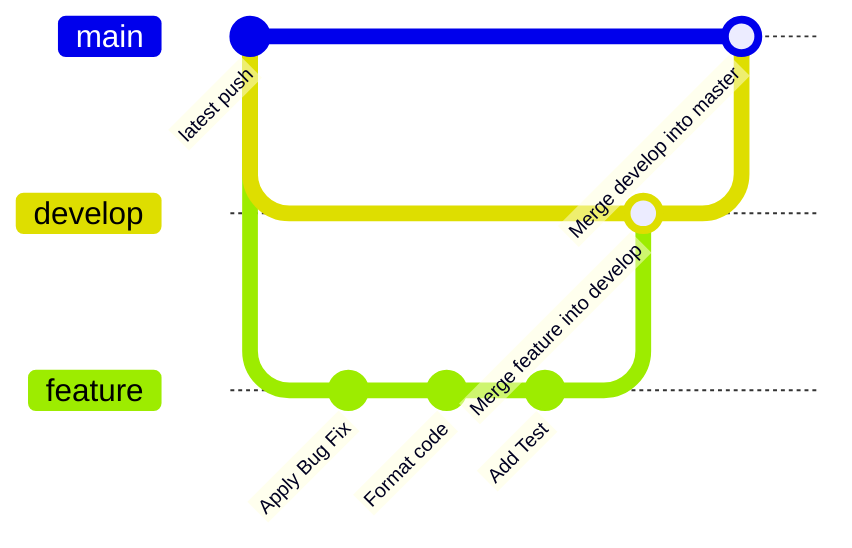
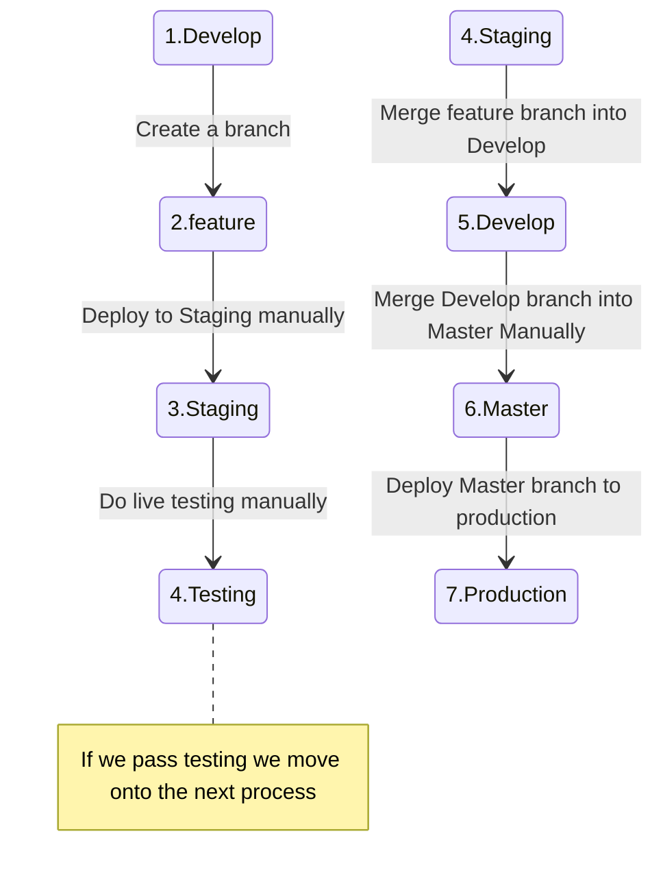
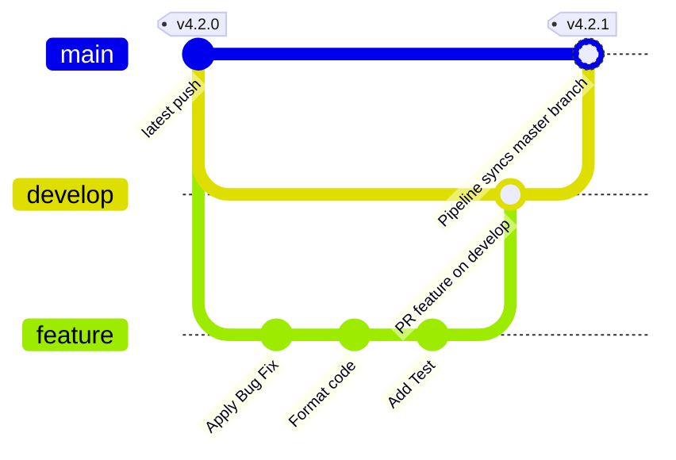
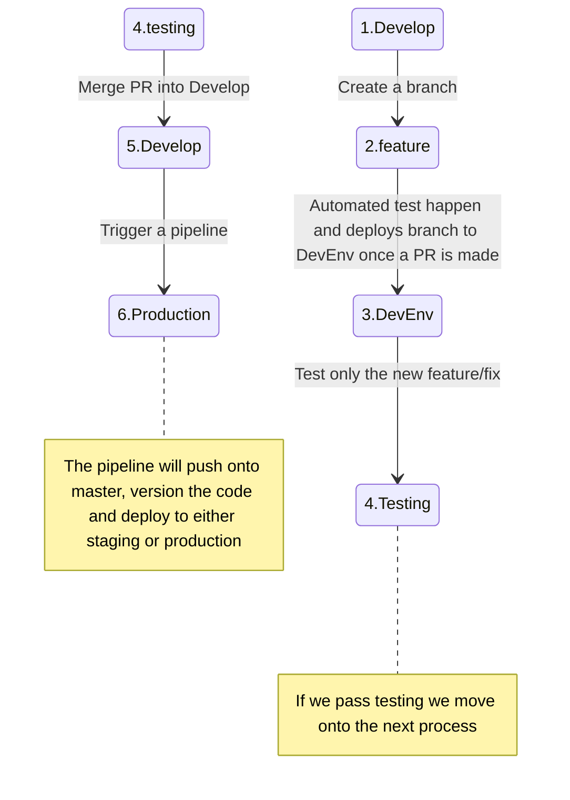

# Our workflow

## Current 

For development we do the following:

1. Make a feature branch based on our issue
2. Make all commits on this branch
3. When the issue is complete we manually deploy this feature branch onto staging 
4. We start with with testing features that have been changes, not checking all functionality of the system to save time
5. If testing passes Tawona takes a look at our implementation and tells us what changes we need to make
6. We make those implementation changes
7. we merge this branch and the develop branch handling stuff like re-basing and merge errors
8. After this we merge the develop branch into the master branch handling stuff like re-basing and merge errors
9. We deploy the master branch to production manually

In git it looks like this

It can also be represented like this

#### Deployment

-  When we deploy we manually go onto heroku, login and navigate the UI and enter the name of our branch that should be deployed

#### Testing

- We manually test the functionality impacted by the changes we make, Not testing all of the functionality of the system

### The Problem!
This leaves us with lots of places for small errors and ways how a small oversight could get by, additionally it takes very long and has still let bugs through even after taking a while.

I suggest we implement the following DevOps practices in order to improve the quality of our code, as well as Developer Experience.

| Task Description                                                                                           | Improves which process                                 | Estimated Time       | Future Work Required                          |
|-------------------------------------------------------------------------------------------------------------|---------------------------------------------|-----------------------|-----------------------------------------------|
| Linting checks (ensures code formatting)                                                                    | Developer Experience / quality of code      | 4 hours               | No/Very little future work required              |
| Automated tests (unit tests, integration tests)                                                              | System quality                              | 80+ hours             | Requires Devs to write tests for new features |
| CI pipeline (automated Linting and tests)                                                                   | System quality                   | 4-8 hours             | Very little future work required              |
| CD pipeline (automated build and deployment)                                                                | Deployment process                            | 16-20 hours           | Very little future work required              |

Implementing those changes will cause our processes to look like this

## The Pipelines

The pipelines can be broken into 2 main categories, CI and CD.

CI or continues intergration is a pipeline that integrates into Version Control software like git. It triggers on a specific action such as making a PR, That way github then creates a virtual server which downloads all the dependencies and runs tests such as unit tests, and Integration tests. then it gives a checkmark or a red crossmark next to the PR showing us if the tests passed or if they failed, This ensures all functionality of the app is working and that no functionality broke due to our changes. This only leaves checking the implementation for Tawona and Live testing, while not having to worry about if the changes effect the apps in unknown ways

CD or continues delivery is a pipeline that also integrates into git, Github creates a virtual server which can download the dependencies and build the Android APK and IOS archive concurrently based on the code in the repo, additional we have it tag the code with a version, and communicates with Heroku (or any other service we use to deploy) that it should start deploying this new tagged version on specific environments. This means we can ensure the code that is being built has all the right configurations and removes the entire misconfiguration problem.

## Future

For development we can do the following:

1. Make a feature branch based on our issue
2. Make all commits on this branch
3. When the issue is complete we make a PR to develop
4. Automated pipelines will handle testing all features, if they pass it will deploy onto the Dev Env
5. We only test the new feature or changes to ensure it works how we want.
6. Tawona can take a look at implementation 
7. We make those implementation changes and Tawona approves PR. The PR can then version the code and deploy the changes into production or Staging

In git it looks like this

It can also be represented like this

#### Deployment

-  Deployments are automated so no manual intervention is needed, but we can still deploy manually via heroku at any time.

#### Testing

- All other functionality is tested automatically so we only manually test the functionality impacted by the changes we make. 
